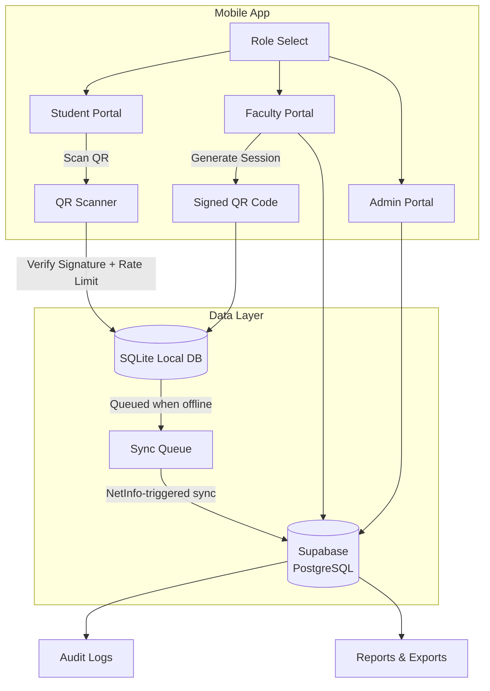

<div align="center">


# Dumalo

**QR-powered attendance, reimagined for modern classrooms.**

An offline-first attendance management system that replaces paper sign-in sheets with cryptographically signed QR codes built for students, faculty, and administrators.


> ⚠️ **Research project in active development**
<br>features and APIs may change.

</div>

---

## 📖 Table of Contents

- [About](#-about)
- [Features](#-features)
- [Tech Stack](#-tech-stack)
- [Architecture](#-architecture)
- [Getting Started](#-getting-started)
- [Project Structure](#-project-structure)
- [Security](#-security)
- [Roadmap](#-roadmap)
- [License](#-license)

---

## 🎯 About

Taking attendance in schools is slow, error-prone, and wastes valuable class time. **Dumalo** modernizes this with a QR-based flow: faculty generate a signed, time-limited QR code for each session, and students scan it in seconds even with no internet connection.

Built for **students**, **faculty**, and **administrators**, Dumalo covers the full attendance lifecycle: session creation -> QR generation -> scanning -> offline storage -> cloud sync -> auditing -> reporting.

### Why offline first?

Classrooms don't always have reliable internet. Dumalo stores every scan locally in SQLite and intelligently syncs to Supabase the moment connectivity returns so attendance is never lost.

---

## ✨ Features

### For Students
| Feature | Description |
|---|---|
| 📷 **Instant QR Scanning** | Scan a faculty-generated QR code using the in-app camera |
| 🔔 **Late Detection** | Automatically flagged as late when scanned past the session's threshold |
| 📶 **Offline Recording** | Attendance is saved locally and queued for sync — no internet required |
| 📱 **Role Select** | Simple role-based sign-in for students & faculty |

### 👨‍🏫 For Faculty
| Feature | Description |
|---|---|
| 🎫 **Signed QR Session Generation** | Cryptographically signed, rotating QR codes with 15-second intervals |
| ⏱️ **Session Controls** | Per-session late thresholds, expiry times, and class/event session types |
| 📊 **Real-Time Reports** | Live attendance views with CSV, Excel-compatible, and PDF export |
| 👥 **Class Management** | Manage sessions, sections, and student records per class |
| 🏛️ **Student Council Support** | Dedicated role with faculty-level permissions |

### 🛠️ For Administrators
| Feature | Description |
|---|---|
| 📈 **Overview Dashboard** | Live counts for students, faculty, subjects, and sections |
| 👤 **Full Directory Management** | CRUD for students, faculty, subjects, sections, and events |
| 🔄 **Faculty Assignments** | Map faculty to their subjects and sections |
| 🕵️ **Audit Log** | Complete trail of system actions for accountability |
| 📄 **Reports Export** | Export attendance data in CSV / Excel / PDF formats |

### 🔐 Platform-Wide
| Feature | Description |
|---|---|
| 🔏 **Signed QR Payloads** | SHA-256 HMAC signatures prevent QR forgery |
| 🚦 **Rate Limiting** | Anti-abuse scanning protections |
| 🔄 **Automatic Sync** | Network-aware queue syncs sessions, attendance, and token rotations |
| 🛡️ **Role-Based Access** | Granular permissions per role (student / faculty / student council / admin) |
| 🗃️ **Edge Functions** | Supabase serverless functions for account creation & deletion |

---

## 🧰 Tech Stack

| Layer | Technology |
|---|---|
| **Mobile Framework** | [React Native](https://reactnative.dev/) + [Expo SDK 57](https://expo.dev/) |
| **Language** | [TypeScript](https://www.typescriptlang.org/) |
| **Navigation** | [Expo Router](https://docs.expo.dev/router/introduction/) (file-based) |
| **UI** | [NativeWind](https://www.nativewind.dev/) / TailwindCSS, Expo Glass Effect |
| **State** | [Zustand](https://zustand-docs.pmnd.rs/) |
| **Backend** | [Supabase](https://supabase.com/) (Auth + PostgreSQL + Edge Functions) |
| **Local Storage** | [SQLite](https://www.sqlite.org/) via `expo-sqlite` |
| **QR** | `expo-camera` (scan) + `react-native-qrcode-svg` (generate) |
| **Exports** | CSV, Excel-compatible HTML, PDF (via `expo-print`) |

---

## 🏗️ Architecture



---

## 🚀 Getting Started

### Prerequisites

- Node.js 20+ & npm
- Expo Go app on your device, or an emulator/simulator
- A Supabase project (for backend services)

### Installation

```bash
# 1. Clone the repository
git clone https://github.com/KPMii/Attend-app.git
cd Attend-app

# 2. Install dependencies
npm install

# 3. Configure environment variables
cp .env.example .env.local
```

Set your Supabase credentials and QR signing secret in `.env.local`:

```env
EXPO_PUBLIC_SUPABASE_URL=your-supabase-url
EXPO_PUBLIC_SUPABASE_ANON_KEY=your-anon-key
EXPO_PUBLIC_QR_SECRET=your-hmac-secret
```

### Run

```bash
# Start the Expo dev server
npm start

# Or launch directly on a platform
npm run android
npm run ios
npm run web
```

### Deploy Supabase Edge Functions

```bash
supabase functions deploy create-student create-faculty delete-account
```


## 📂 Project Structure

```
Attend-app/
├── src/
│   ├── app/                  # Expo Router file-based routes
│   │   ├── index.tsx         # Role select screen
│   │   ├── student/          # Student portal (QR scanner, login, settings)
│   │   ├── faculty/          # Faculty portal (QR generator, sessions, reports)
│   │   └── admin/            # Admin portal (dashboard, directory, audit, reports)
│   ├── components/           # Reusable UI & lazy-loaded components
│   └── lib/                  # Core logic: db, sync queue, auth, exports, audit
│       ├── db.native.ts      # SQLite local storage (native)
│       ├── db.web.ts         # Local storage (web)
│       ├── syncQueue.ts      # Network-aware sync engine
│       ├── rateLimit.ts      # Scan rate limiting
│       ├── csvExport.ts      # CSV / Excel exports
│       └── pdfShare.ts       # PDF generation & sharing
├── stores/
│   └── authStore.ts          # Zustand auth + permission state
├── supabase/
│   └── functions/            # Edge functions (create-student, create-faculty…)
├── types/                    # Shared TypeScript types
├── app.json                  # Expo configuration
└── package.json
```


## 🔒 Security

Dumalo treats attendance integrity as a first-class concern:

- **Cryptographically signed QR codes** — Each session payload includes a SHA-256 HMAC signature derived from a server-side secret, preventing students from forging or replaying QR codes.
- **Short-lived sessions** — QR codes expire automatically, with rotating tokens issued every 15 seconds.
- **Rate limiting** — Anti-automation protections on scan attempts.
- **Audit trail** — Every sensitive action is logged for administrative review.
- **Row-level security** — Supabase policies enforce role-based data access at the database level.


## 🗺️ Roadmap

- [x] Role-based portals (student / faculty / admin)
- [x] Signed QR session generation & scanning
- [x] Offline-first sync via SQLite + sync queue
- [x] CSV / Excel / PDF reporting
- [ ] Push notifications for session reminders
- [ ] Biometric sign-in
- [ ] Multi-school support hardening
- [ ] Companion web dashboard for admins

---

## 📄 License

© 2026 KPMua. All Rights Reserved.

See the [LICENSE](LICENSE) file for details. Third-party licenses are documented in [THIRD-PARTY-LICENSES](THIRD-PARTY-LICENSES).