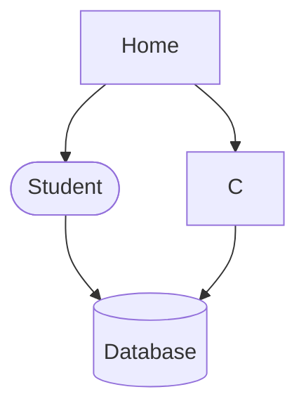

# Dumalo App

A QR-based attendance system for students and faculty.
An attendance management system designed for schools to simplify and modernize student tracking using QR-based authentication and offline-first synchronization.
This project is still in active development and features may change.

## Main Features

- QR attendance system
- Offline sync
- Supabase backend

Experimenting my README hahahahah

##

## Other Features

-
